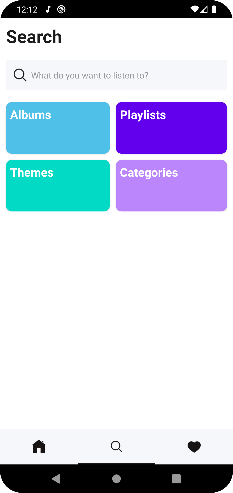

# Demo App: My Music.
This is a demo of a music player I wrote, so it's based on a template I've read on the internet. Now take a preview:

<pre>
                  
</pre>

 # Implementations:
    // network
    implementation 'com.squareup.retrofit2:retrofit:2.3.0'
    implementation 'com.squareup.retrofit2:converter-gson:2.3.0'

    // load image
    implementation 'com.squareup.picasso:picasso:2.5.2'
    implementation 'com.github.bumptech.glide:glide:4.12.0'
    annotationProcessor 'com.github.bumptech.glide:compiler:4.12.0'

    //circle indicator for banner
    implementation 'me.relex:circleindicator:1.2.2@aar'
    implementation 'com.eftimoff:android-viewpager-transformers:1.0.1@aar'
    
    // circle image view for play song image
    implementation 'de.hdodenhof:circleimageview:2.2.0'
    // notification
    implementation "androidx.media:media:1.2.0"
    

# 💫About Me :

I'm a android developer from Vietnam.

- 🔭 I’m currently studying at [Vietnam Academy of Cryptography Techniques](https://actvn.edu.vn/)

- 🌱 I’m currently learning **Android(Java)**

- 💬 Ask me about **android, mobile,..**

- 📫 How to reach me **huuthom0209@gmail.com**

# 🌐Socials
    

### ✍️Random Dev Quote

---

